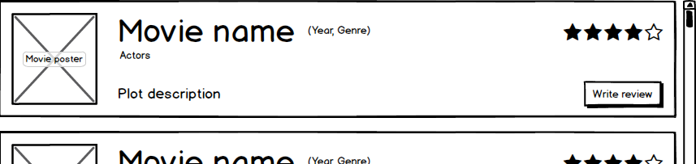

# Recruitment task

👋 Hello!

Welcome to your test assignment for the position of C# fullstack / backend engineer at 🚩 **Secret Control GPS**.
Below you can find the requirements defined for the backend and frontend seperately - if you are applying 
solely as a backend engineer, you won't need to implement the frontend requirements!

### Overview

We need a little 🎥 movie database webapp (REST API + GUI), where users can 🔍 check movies and ✍️ write movie reviews.

### Specification

#### Backend requirements

Create a REST API which implements the following endpoints:

* `POST /movies`:
  * Must store a new movie in the database if does not exist. The movie title is enough in the request body.
  * Additional movie details should be fetched from http://www.omdbapi.com/ and persisted to database. 
    (At least save these fields: `Title`, `Year`, `Genre`, `Actors`, `Poster`, `imdbRating` - will be needed by the frontend).
  * Response should contain the additional fields fetched from the external API.
* `GET /movies`:
  * Must return all movies stored in the database.
  * 🦸 _Implmenting filtering, sorting is a bonus._
* `POST /reviews`:
  * Request must contain the movie ID (already present in database) and the review text in its body.
  * The review has to be persisted to database and returned in the response.
* `GET /reviews`:
  * Must list all existing reviews from the database.
  * Should support filtering on movie ID.

#### Frontend requirements:

Create a graphical user interface (GUI) where users can do the following things:

* **Home view**:
  * Show a list of all movies fetched from the API.
  * The list should be similar to the wireframe inserted below, but you are allowed to come out with any design which you think suits better. 
  
  * Clicking the _Write review_ button must navigate to the **Write Review view**, clicking anywhere else on the list item (eg.: poster, title) should naviage to the **Reviews view**.
  * Support the user with an arbitrary widget (eg.: textbox and a button) that allows adding a new movie to the database.
  * 🦸 _Filtering, ordering is an additional bonus._
* **Reviews view**:
  * Using tha proper API route, show a list of reviews associated with a given movie.
  * You can simply put the reviews in textboxes under each other.
  * Place a button which navigates back to the **Home view**.
* **Write review view**:
  * Show a text area and a button where the user can submit a review for the selected movie.
  * Place a button which navigates back to the **Home view**.

### Rules & hints
* For the backend, we recommend using .NET Core Web API, but the classic Web API 2 for the .NET Framework is also allowed. We do not recommend using legacy technologies like WCF webservice.
  * You can use any database storage you like - but at least it should be able to be hosted in a Docker Container. For simplicity, we recommend using [SQLite](https://sqlite.org/) for this project - its serverless and easy to use and you can also include your database schema as a file in your repository.
  * 🦸 _If you stays with an RDBMS that supports SQL, using ORM technologies like EntityFramework, [Dapper](https://dapper-tutorial.net/) or at least a query builder like [SqlKata](https://sqlkata.com/) is highly appreciated._
* For the frontend, you can choose between web (_HTML5_ with _JavaScript_ / _TypeScript_) or desktop (any .NET based, eg.: _WinForms_, _WPF_) based appication. Using a web based technology with a modern SPA framework (eg.: _Angular_, _ReactJs_) or any micro MVVM framework (eg.: _AlpineJs_) is big plus 🙂. 
* Your application's code should be uploaded to a public Git repository which you must grant access to us. Please, include README file with basic notes on application requirements and setup - we must be able to easily build and run it by ourselves.
* 🏖️ Relax, there's no time limit for the task (at least in reasonable limits). If you feel that the task is too much, you can skip some parts of it, and we will discuss how you would have done the remaining parts.

**Good luck! If you are stuck or have any questions feel free to contact us!**
